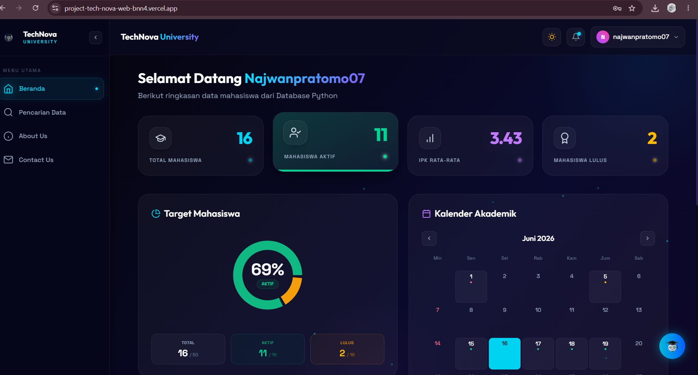
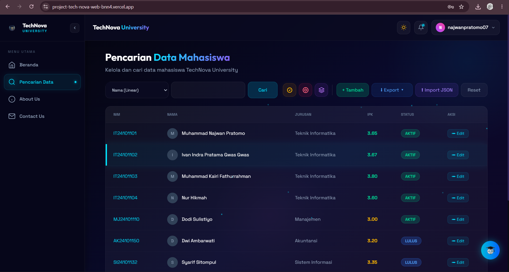
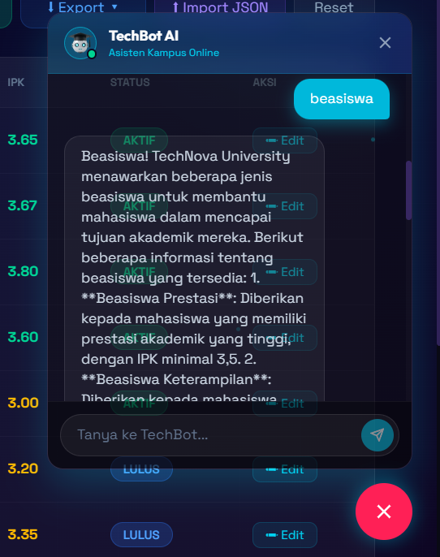

# 🚀 TechNova University — Full-Stack Management System

| 🌐 Live Demo Platform | [project-tech-nova-web-bnn4.vercel.app](https://project-tech-nova-web-bnn4.vercel.app/) |
|---|---|

> **Tech Stack:** React.js, TypeScript, Vite, Tailwind CSS (Frontend) | Python Flask API (Backend)

# 🚀 TechNova University — Manajemen Data Mahasiswa

[](https://project-tech-nova-web-bnn4.vercel.app/)

Aplikasi web manajemen data mahasiswa (*Full-Stack*) interaktif berbasis AI yang dibangun dalam waktu **5 hari**. Proyek ini mengintegrasikan visualisasi data modern, manajemen CRUD, implementasi algoritma pencarian data, serta chatbot cerdas untuk simulasi administrasi kampus.

---

## 🌟 Fitur Utama

* **Dashboard Interaktif & Live Tracker:** Memonitor statistik mahasiswa (Total, Aktif, IPK Rata-Rata, Lulus) dengan visualisasi *Progress Ring* dan grafik pembaruan data otomatis setiap 3 detik.
* **Manajemen Data & CRUD:** Fitur Tambah, Edit, Hapus, serta Export/Import data berbasis JSON pada menu Pencarian Data.
* **Algoritma Pencarian Terintegrasi:** Implementasi nyata algoritma *Linear Search*, *Binary Search*, dan *Sequential Search* untuk memfilter data mahasiswa berdasarkan kriteria tertentu.
* **TechBot AI Chatbot:** Asisten kampus online berbasis kecerdasan buatan yang responsif dan mampu memberikan informasi akademik terstruktur (seperti informasi beasiswa, agenda, dll.).
* **Responsive Dark Mode UI:** Desain antarmuka modern yang konsisten memanfaatkan tren *glassmorphism* dengan skema warna futuristik.
* **Kalender Akademik & Agenda:** Integrasi jadwal kegiatan kampus (*event markers*) lengkap dengan pengingat agenda bulanan seperti seminar dan pekan UAS.

## 🛠️ Tech Stack

* **Frontend:** React.js, TypeScript, Vite, Tailwind CSS
* **Backend:** Python (Flask API)
* **Deployment:** Vercel

---

## 📷 Tangkapan Layar (Screenshots)

### 1. Dashboard Utama & Live Tracker
*()*

### 2. Fitur Pencarian & Algoritma Data
*()*

### 3. TechBot AI Chatbot (Informasi Beasiswa)
*()*

---

## ⚙️ Cara Menjalankan Proyek Secara Lokal

1. **Clone Repositori:**
   ```bash
   git clone [https://github.com/Najwan078/TechNova_web](https://github.com/Najwan078/TechNova_web.git)
   cd TechNova_web